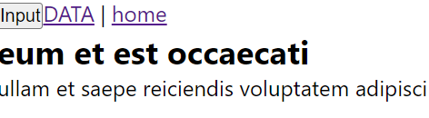
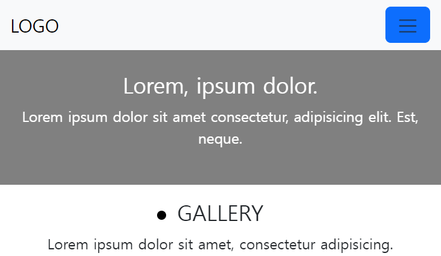
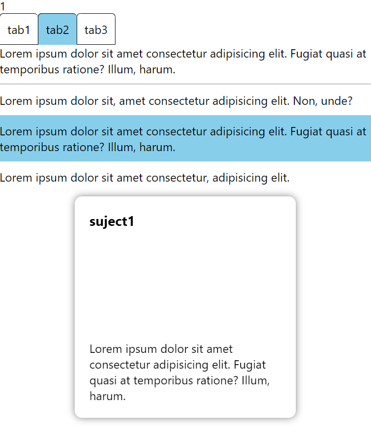
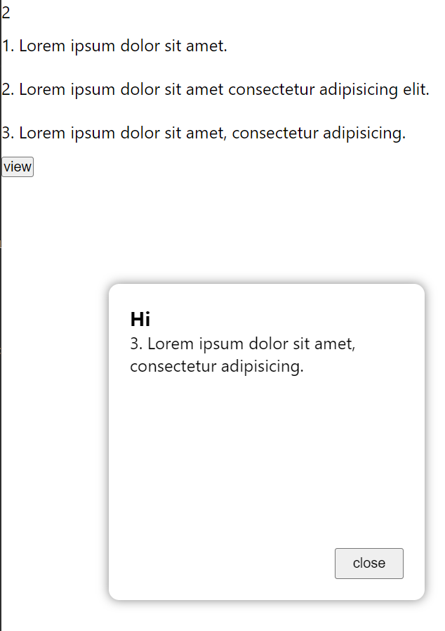
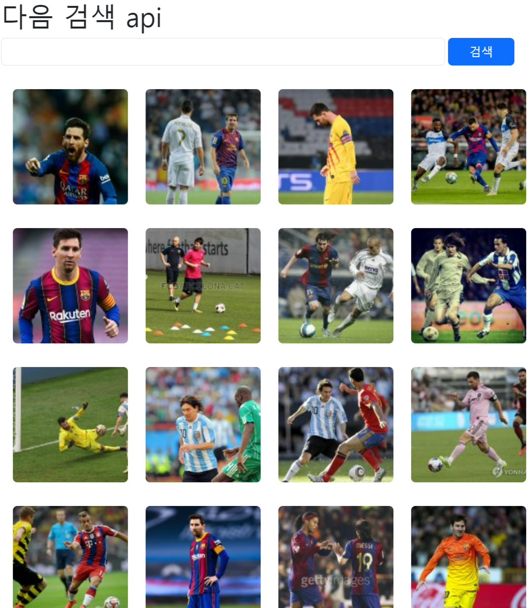

# React 다양한 개념

- data.js로 Data 화면에 뿌리기 (App boot01.js, App cardView.js, App detail.js, App imgView.js, App_data.js)
- 앱 화면 크기 시 hamburger button (App hamburger.js, view.scss)
- click 시 +1 / 오늘 날짜 목록 / 모달 (App state.js)
- props 예제
  1. App props.js : onClick 시 bgc skyblue & 해당 글 모달
  2. App props2.js : cusor 인식시 bgc skyblue & onClick 시 해당 글 모달 & 모달 close button
- 리스트 항목 onClick 시 모달에 해당 글 input (App_input.js, Modal.jsx)
- 카카오 사진 검색 API (App apiclose.js)

# React 화면

- App posts.js

  

- App hamburger.js : 앱 화면 크기 시 hamburger button

  

- App props.js : onClick 시 bgc skyblue & 해당 글 모달

  

- App props2.js : cusor 인식시 bgc skyblue & onClick 시 해당 글 모달 & 모달 close button

  

- App apiclose.js : 카카오 사진 검색 API

  
